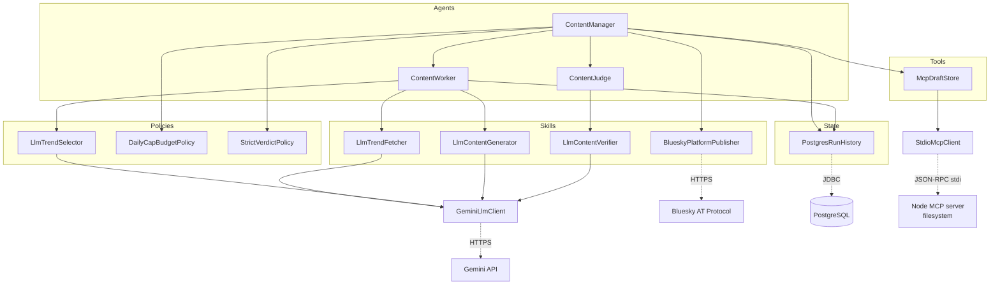
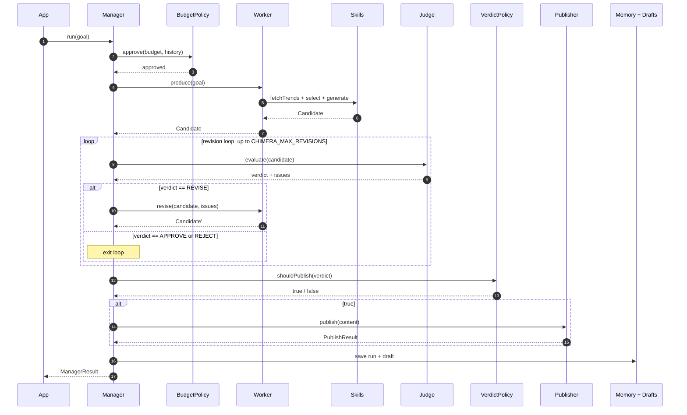

# Project Chimera

**An autonomous AI influencer that picks topics, writes posts, has another LLM
review them, and publishes to a real social network -- in a multi-turn loop
that revises drafts when the reviewer pushes back.**

Built in Java 21 around the Manager / Worker / Judge agent pattern, with
swappable LLM providers, event-sourced memory in PostgreSQL, and a custom
MCP client wired in for external tools.

---

## What it does

When you run `make run`, the agent:

1. Asks Gemini for trending topics in a configured category
2. Picks a trend it hasn't used before (memory-aware selection)
3. Asks Gemini to write a script and a caption matching the persona
4. Asks a *different* Gemini prompt to evaluate the result for safety and quality
5. If the evaluator says **REVISE**, sends the feedback back to the writer and tries again (up to a configured cap)
6. If approved, posts to your Bluesky account
7. Records the entire run to PostgreSQL and (optionally) writes a markdown draft to disk via an MCP filesystem server

Here's a real run -- timestamps shortened for readability:

```text
INFO  [App] Chimera starting: single Manager run, goal=PipelineRequest[platform=bluesky, category=fitness, ...]
INFO  [ContentManager] Manager starting: target=1 posts, maxRevisions=1
INFO  [ContentManager] === Cycle 1/1 ===
INFO  [ContentWorker] Worker: fetching trends for category=fitness on bluesky
INFO  [GeminiLlmClient] Calling LLM (412 prompt chars, model=gemini-2.5-flash-lite)
INFO  [GeminiLlmClient] LLM responded in 2150ms (380 chars)
INFO  [ContentWorker] Worker: got 5 trend(s)
INFO  [ContentWorker] Worker: selecting a trend...
INFO  [ContentWorker] Worker: selected 'mental health through movement' (engagement=0.91)
INFO  [ContentWorker] Worker: generating content...
INFO  [GeminiLlmClient] LLM responded in 4442ms
INFO  [ContentWorker] Worker: produced candidate (contentId=llm-...)
INFO  [ContentJudge] Judge: evaluating candidate
INFO  [GeminiLlmClient] LLM responded in 2665ms
INFO  [ContentJudge] Judge: verdict=APPROVE (safetyScore=0.95, 0 issue(s))
INFO  [BlueskyPlatformPublisher] Publisher: posting to Bluesky as @your-handle.bsky.social
INFO  [BlueskyPlatformPublisher] Publisher: posted successfully (at://did:plc:.../app.bsky.feed.post/...)
INFO  [ContentManager] Cycle 1: PUBLISHED (0 revisions used)
INFO  [ContentManager] Manager done: requested=1, published=1, rejected=0, errored=0
```

Each LLM call is a real API request. The post URI at the end resolves to a
real public post on Bluesky.

---

## Quick start

**Prerequisites:** Java 21+, Maven 3.8+, Docker (optional for the compose
path), Node.js (optional for the MCP integration).

### Option A: run locally

```bash
# 1. Set up secrets
cp .env.example .env
# Edit .env and fill in: GEMINI_API_KEY, BLUESKY_HANDLE, BLUESKY_APP_PASSWORD,
# DATABASE_USER, DATABASE_PASSWORD

# 2. Create the local Postgres database (one time)
sudo -u postgres psql -c "CREATE ROLE $USER WITH LOGIN CREATEDB PASSWORD '...';"
sudo -u postgres psql -c "CREATE DATABASE chimera_dev OWNER $USER;"
psql -d chimera_dev -f db/init.sql

# 3. Run
make setup        # resolve Maven dependencies
make test         # run the test suite
make run          # one cycle
make run-loop     # run continuously, every CHIMERA_LOOP_INTERVAL_MINUTES
```

### Option B: docker compose (no Java/Maven/Postgres needed locally)

```bash
cp .env.example .env
# Fill in GEMINI_API_KEY, BLUESKY_HANDLE, BLUESKY_APP_PASSWORD

make docker-up    # builds the app image, starts Postgres + agent
make docker-logs  # tail the agent's logs
make docker-down  # tear down
```

The compose stack auto-loads the schema, wires the app to the db service,
and overrides `DATABASE_URL` so localhost references resolve correctly.

---

## Architecture

The system is split into five layers, each behind interfaces:

```
Agents       Manager / Worker / Judge   <-  coordinate, execute, evaluate
Policies     TrendSelector / Budget /    <-  small decisions consulted
             VerdictPolicy
Skills       TrendFetcher / Generator /  <-  capabilities (1 LLM-backed each)
             Verifier / Publisher
State        RunHistory                  <-  what the agent remembers
Clients      LlmClient / McpClient /     <-  wire-protocol shims to outside
             JDBC / Bluesky HTTP
```

### Component map



The Manager runs a **multi-turn loop**: produce → judge → revise (if asked) →
publish. The revision feedback is what makes this an *agent*, not a pipeline.

### One cycle, end to end



> Deployment topology and deeper design rationale (the *"why this shape"*
> section) live in **[`specs/architecture.md`](specs/architecture.md)**.

---

## What's interesting about it

If you only have time to skim a few things in this repo, look at these:

### 1. The policy pattern

Three "decisions" the agent makes are pulled out into pluggable policies:

| Decision | Interface | Naive impl | Smart impl |
|---|---|---|---|
| Which trend to pick? | `TrendSelector` | `NaiveTrendSelector` (first one) | `LlmTrendSelector` (LLM-backed, memory-aware) |
| Is this budget approved? | `BudgetPolicy` | `NaiveBudgetPolicy` | `DailyCapBudgetPolicy` (sums history) |
| Should we publish given the verdict? | `VerdictPolicy` | `StrictVerdictPolicy` | `PermissiveVerdictPolicy` |

Same interface, different brains. **Rule-based and LLM-backed
implementations are interchangeable** -- swapping `MemoryAwareTrendSelector`
for `LlmTrendSelector` is one constructor argument. The pipeline doesn't
change.

### 2. LLM-as-Judge with a strict output contract

`LlmContentVerifier` uses the same LLM that wrote the content to evaluate it
-- a different role expressed entirely in the prompt. The Verifier's prompt
asks for a strict JSON shape:

```json
{"verdict":"APPROVE|REVISE|REJECT", "safetyScore":0.95, "issues":[...]}
```

If the LLM returns garbage, the parser **throws rather than defaulting to
APPROVE**. Safety guardrails are policy code, not LLM trust.

### 3. The revision loop

When the Judge says REVISE with concrete issues, the Manager sends those
issues back to the Worker, which regenerates with the feedback baked into
its prompt. This continues up to `CHIMERA_MAX_REVISIONS` round-trips per
post. **Six LLM calls for one published post**, but the result is
meaningfully better than a single-shot generator.

### 4. Event-sourced memory

Every cycle becomes a single `RunRecord` stored as JSONB in `run_history`.
JSON-path indexes (`(goal->>'category')`, `(result->'generatedContent'->>'contentId')`)
support the questions the agent actually asks. No migrations when records
evolve.

### 5. A real MCP client built from scratch

`StdioMcpClient` is ~150 lines that speak JSON-RPC 2.0 over a Node
subprocess's stdin/stdout. Spawns the official `@modelcontextprotocol/server-filesystem`,
does the initialize handshake, calls `tools/list` and `tools/call`. The
agent uses this to write reviewable markdown drafts to disk. Same protocol
as the Anthropic / OpenAI MCP servers -- swappable.

---

## Tech stack

| Layer | Choice | Why |
|---|---|---|
| Language | Java 21 | Records, sealed types, modern HTTP client, virtual threads |
| Build | Maven | Standard for Java, integrates with everything |
| Tests | JUnit 5 | Native parameterized + nested tests |
| Lint | Checkstyle | Enforced via `make lint` and CI |
| LLM | Google Gemini (2.5-flash-lite) | Free tier, no credit card required |
| Persistence | PostgreSQL 16 (JSONB) | First-class JSON, indexable JSON paths |
| Connection pool | HikariCP | Production-standard JDBC pooling |
| Logging | SLF4J + Logback | Industry-standard, configurable per-class |
| Publishing | Bluesky AT Protocol | Real social network, no app review needed |
| Tools | MCP (filesystem server) | Open standard for agent tools |
| Container | Multi-stage Dockerfile + compose | One-command setup |

---

## Repo layout

```
project_chimera/
├── chimera/chimera-core/             # The Maven module
│   └── src/main/java/com/chimera/
│       ├── agent/                    # Manager, Worker, Judge + DraftStore
│       ├── content/                  # ContentGenerator skill (mock + LLM)
│       ├── trend/                    # TrendFetcher skill (mock + LLM)
│       ├── verifier/                 # ContentVerifier skill (mock + LLM)
│       ├── publisher/                # PlatformPublisher skill (Bluesky impl)
│       ├── policy/                   # TrendSelector, BudgetPolicy, VerdictPolicy
│       ├── persistence/              # RunHistory + Postgres impl + Json helper
│       ├── orchestrator/             # Records (PipelineRequest, PipelineResult)
│       ├── llm/                      # LlmClient interface + Gemini impl
│       ├── mcp/                      # MCP client (interface + stdio impl)
│       ├── config/                   # Config (.env loading)
│       └── App.java                  # Composition root
│
├── specs/                            # Spec-driven dev artifacts
│   ├── _meta.md                      # Vision, constraints, non-goals
│   ├── functional.md                 # User stories
│   ├── technical.md                  # API contracts, DB ERD
│   ├── architecture.md               # Diagrams + design rationale  ★
│   └── openclaw_integration.md       # Bonus protocol spec
│
├── skills/                           # Skill READMEs (input/output contracts)
├── db/init.sql                       # Schema (run_history table + indexes)
├── docker-compose.yml                # Postgres + agent stack
├── Dockerfile                        # Multi-stage build with shaded JAR
├── Makefile                          # setup, test, lint, build, run, run-loop, docker-up, ...
└── .env.example                      # Template for secrets and runtime config
```

---

## Status

**72 tests pass**, including real integrations:

- Round-trip serialization through PostgreSQL JSONB
- Real Gemini API call
- Real Bluesky post (creates a deletable post on your account)
- Real MCP subprocess (spawns the Node filesystem server)
- Multi-turn revision loop (Judge says REVISE → Worker tries again → Judge approves)

Every "skill" is real (LLM- or HTTP-backed) -- there are no mocks left in
the production code path. Mock implementations exist in `src/main/java`
only for use in fast unit tests.

---

## Roadmap

What's intentionally not done yet:

- **Concurrent multi-Worker execution.** The Manager runs cycles sequentially. Java 21 virtual threads would allow N posts to be produced in parallel; the architecture supports it but it's not wired up.
- **Human-in-the-loop approval gate.** Real production agents need this; the architecture has a clean seam for it (a `VerdictPolicy` that pauses for input). Skipped for now.
- **Real ContentVerifier safety checks against external moderation APIs.** Currently the Verifier is purely LLM-as-Judge. Could be augmented with OpenAI's free moderation API or similar.
- **Web UI showing the agent's reasoning live.** Logs do this in the terminal but a small web view would be more presentable.
- **A second Bluesky agent so the agent's posts can engage with each other** (long-term -- requires the OpenClaw-style protocol from `specs/openclaw_integration.md`).

---

## Why I built this

Most "AI agent" tutorials stop at "loop an LLM until it says done." That
hides the real engineering: **the architecture you build around the LLM is
what makes agents reliable**.

Project Chimera was an excuse to work through every load-bearing piece of
that architecture from scratch -- the Manager / Worker / Judge separation,
swappable rule-based and LLM-backed policies, event-sourced memory you can
actually query, output validation that doesn't trust the LLM, and a wire
protocol (MCP) for plugging in external tools. Same patterns I'd reach for
in production code, scaled down to a project that fits on one screen.

---

## License

MIT.
