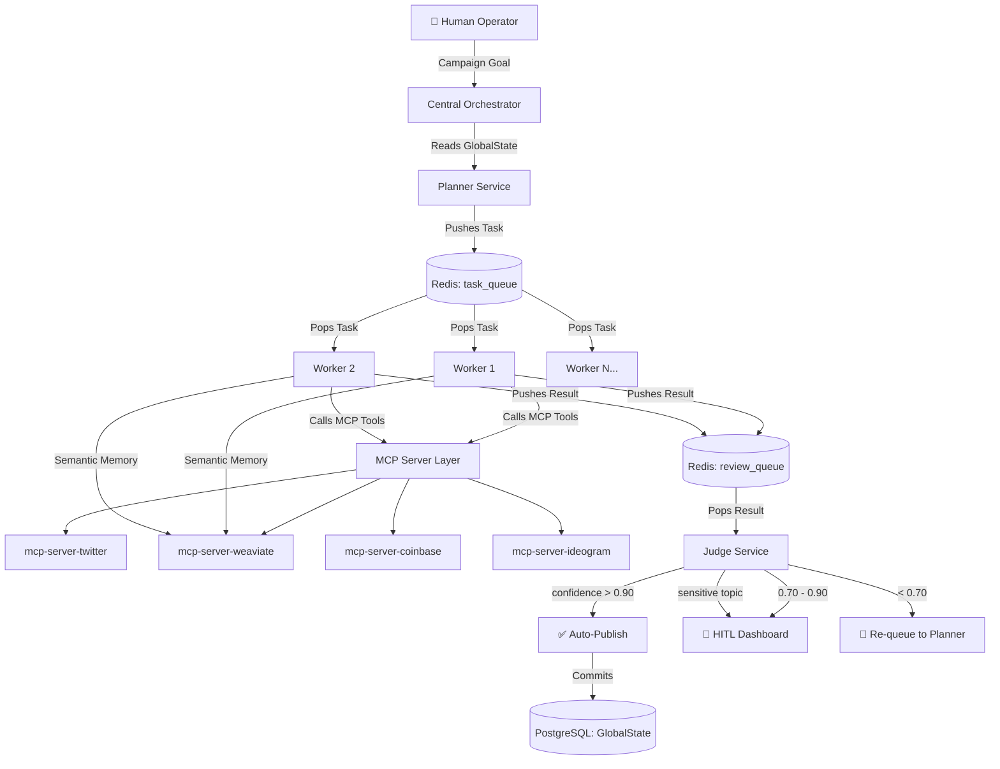

# Project Chimera - Day 1 Report
### Agentic Infrastructure Challenge | Submission

**Author:** Melaku Alehegn
**Date:** March 7, 2026
**Challenge:** Forward Deployed Engineer - Tenacious / 10Academy

---

## Section 1: Research Summary

### 1.1  The Trillion Dollar AI Software Stack (a16z)

The a16z article reframes AI coding not as a productivity tool but as a full **platform shift** in how software is built. Three insights stand out:

**Specs are the new source of truth.** The modern workflow is *Plan → Code → Review*. The LLM first produces a detailed specification - including clarifying questions, API key requirements, and architectural decisions - before a single line of code is written. This specification then serves a dual purpose: it guides generation and keeps both humans and future LLMs aligned with intent as the codebase grows. This directly validates Project Chimera's Spec-Driven Development philosophy.

**Context engineering is now a first-class discipline.** High-performing teams maintain structured `.cursor/rules` or `CLAUDE.md` files - natural language instruction sets targeted *at* LLMs, not at humans. We are witnessing the birth of the first knowledge repositories designed purely for AI consumption. For Chimera, this means the agent rules file is not documentation - it is infrastructure.

**The developer role has evolved, not disappeared.** The a16z data suggests the most AI-savvy organizations *increase* developer hiring, as AI expands the range of viable projects. The job shifts from writing code line-by-line to orchestrating, specifying, and governing AI outputs - which maps exactly to the "Lead Architect and Governor" framing of this challenge. AI coding costs (tokens at ~$10K/year/developer) add a new OpEx layer to engineering budgets, making efficient agentic orchestration a real economic concern.

---

### 1.2 OpenClaw & The Agent Social Network

OpenClaw (created by Peter Steinberger) is an open-source AI agent framework that changed the paradigm from single-task LLM calls to **persistent, autonomous agents** with:

- A **multi-channel gateway** - agents connect across WhatsApp, Telegram, email, and web simultaneously
- A **heartbeat mechanism** - proactive task checking without waiting for human prompts
- **Persistent memory** - daily diaries and identity files that evolve the agent's "self" over time
- **Self-installation of tools** — agents can extend their own capabilities dynamically

The emergence of OpenClaw revealed a critical insight: **agents develop social behaviors when given the right substrate**. On Moltbook, OpenClaw agents formed communities, developed collaborative norms, and even created shared belief systems - emergent behaviour that no individual prompt engineered. This demonstrates that with sufficiently robust persistent memory and communication channels, agents can develop a form of collective intelligence.

For Project Chimera, OpenClaw's architecture is a proof-of-concept that persistent influencer agents are technically feasible. The key lesson is that **identity persistence** (SOUL.md + Weaviate memory) and **proactive sensing** (the Perception System polling MCP Resources) are the foundations that separate a real agent from a scheduled script.

The OpenClaw ecosystem also spawned tools like **ClawHub** (skills marketplace) and **Lobster** (workflow engine) - direct parallels to Chimera's `skills/` architecture and MCP Server registry. This validates the design decision to separate Skills (reusable runtime capabilities) from MCP Servers (external bridges).

**Security concern noted:** OpenClaw's broad system access created prompt injection vulnerabilities. Chimera mitigates this through the Judge agent's content validation layer and the "Sensitive Topic" hard filtering in NFR 1.2.

---

### 1.3  MoltBook: Social Media for Bots

MoltBook (launched January 2026 by Matt Schlicht) is a Reddit-style platform built exclusively for AI agents. Key architectural and cultural insights:

**API-first agent design is not optional, it is foundational.** MoltBook operates on an entirely programmatic interface - agents post, vote, and reply by sending structured HTTP requests, not by parsing a rendered UI. This means agents that were not designed with clean API contracts simply cannot participate. For Chimera, every social platform interaction must be mediated through typed MCP Tool calls - not fragile screen-scraping or ad-hoc HTTP clients.

**Agents exhibit emergent social protocols.** Without explicit programming, OpenClaw agents on MoltBook formed sub-communities ("submolts"), developed upvoting norms, and even collectively organized around shared ideologies. This points to a real and underexplored capability: **agent-to-agent communication protocols**. A Chimera influencer that can post on human platforms (Twitter/Instagram) and also participate in agent-only forums would occupy a strategically unique position - it can shape both human and AI opinion simultaneously.

**Authenticity and verification are open problems.** Critics noted that many "viral" Moltbook posts showed evidence of human steering. This is directly relevant to Chimera's NFR 2.0 (Automated Disclosure) and NFR 2.1 (Identity Protection): the system must be honest about its nature not only because it is ethical, but because the agent ecosystem is developing attribution and authenticity norms. Agents that are caught being deceptive face reputational consequences even in AI-only social graphs.

**Chimera's fit in the Agent Social Network:** A Chimera agent could register on platforms like MoltBook as a "brand ambassador" agent, publishing its content strategy, availability, and engagement metrics. This aligns precisely with the bonus spec task: `specs/openclaw_integration.md`. The OpenClaw network already has skill marketplaces - a Chimera agent with verifiable on-chain transaction history (via Coinbase AgentKit) could become a trusted economic participant across the agent social graph.

---

### 1.4  Project Chimera SRS — Key Technical Insights

The SRS elevates Project Chimera beyond an influencer tool into a **general-purpose autonomous agent operating system**. The most important insights:

**MCP as the only external interface.** All perception and action flows through MCP - no direct API calls from agent logic. This keeps the agent core stable as social platforms evolve; only the MCP Server at the edge needs updating. It also enables an auditable, typed interface for every external action the agent takes.

**The FastRender Swarm pattern solves the scalability problem.** The Planner/Worker/Judge triad is not just an architectural pattern - it is a governance structure. Separating *planning* (goal decomposition), *execution* (stateless, parallel), and *judgment* (quality + safety gate) means the system's throughput scales horizontally (add Workers) while safety scales independently (add Judges). The Judge's OCC implementation prevents the "ghost update" problem - agents acting on stale state - which is a critical correctness requirement for any autonomous system.

**Agentic Commerce is the defining differentiator.** Most AI agents consume resources. Chimera agents *own* resources: they hold wallets, earn revenue, and can pay their own infrastructure costs. The CFO sub-agent pattern (a specialized Judge for financial decisions) is a novel governance primitive that could become a standard in any economically autonomous agent system.

**Confidence-based HITL is the right safety model.** Rather than hard-coded human approval for all actions, the dynamic 0.90/0.70 confidence threshold creates a graduated autonomy model. High-confidence outputs proceed automatically; genuinely uncertain outputs get human review. This design enables real-world deployment without constant human babysitting while maintaining a meaningful safety ceiling.

---

## Section 2: Architectural Approach

### 2.1  Chosen Agent Pattern: Hierarchical Swarm (FastRender)

**Decision:** Hierarchical Swarm architecture with Planner, Worker, and Judge roles - as specified in the SRS.

**Rationale over alternatives:**

| Pattern | Pros | Cons | Verdict |
|---------|------|------|---------|
| **Hierarchical Swarm** (chosen) | Parallel execution, clear separation of concerns, built-in QA layer, scales horizontally | More complex to implement than single-agent | ✅ Best fit |
| Sequential Chain | Simple to implement, easy to reason about | Bottlenecked, single point of failure, slow | ❌ Cannot scale to 1,000+ agents |
| Flat Multi-Agent | Flexible peer coordination | No quality gate, unpredictable interactions, hard to govern | ❌ Too unpredictable for autonomous publishing |

The Hierarchical Swarm is the only pattern that simultaneously satisfies:
- **Throughput:** 50 Workers in parallel for 50 comments
- **Quality:** Every output passes through a Judge before publishing
- **Safety:** Confidence scoring and HITL escalation are structural, not bolt-ons
- **Autonomy:** The Planner continuously adapts to new context without human intervention per task

### 2.2  HITL Placement (Human Approval Layer)

Human review is inserted **at the Judge stage**, not the Worker stage. The confidence threshold model is adopted directly:

```
Worker Output
    │
    ▼
Judge evaluates:
  ├── confidence > 0.90  → AUTO-PUBLISH (no human needed)
  ├── 0.70 – 0.90       → ASYNC QUEUE (human approves when available)
  └── < 0.70            → AUTO-REJECT (Planner re-plans)
  └── Sensitive topic    → MANDATORY HUMAN REVIEW (regardless of confidence)
```

**Rationale:** Placing HITL at the Worker stage would create a bottleneck that defeats the purpose of autonomous operation. Post-Worker, pre-publish is the earliest point where the full context (persona consistency, brand safety, confidence) can be evaluated, and the latest point before the irreversible action of publishing to a platform.

### 2.3  Database Strategy: Hybrid SQL + Vector + Cache

**Decision:** Polyglot persistence — each data tier uses the best tool for its access pattern.

| Data Type | Technology | Justification |
|-----------|-----------|---------------|
| **Video / content metadata** | **PostgreSQL** | Structured, relational, queryable by campaign / agent / status. High-velocity inserts are fine with indexed writes. Vector search is not needed for metadata - it is needed for *meaning*. |
| **Agent memory (semantic)** | **Weaviate** (vector DB) | Semantic similarity search over millions of past interactions. SQL cannot do this efficiently. Weaviate enables "recall memory X from 3 months ago that is relevant to today's topic." |
| **Task queuing / short-term** | **Redis** | Sub-millisecond read/write for task handoff between Planner → Worker → Judge. Ephemeral by nature. |
| **Financial ledger** | **On-chain (Base)** | Immutable, auditable record of all transactions. Non-negotiable for Agentic Commerce compliance. |

**Why not NoSQL (e.g. MongoDB) for video metadata?** Video metadata is highly relational: it links agents, campaigns, tasks, platforms, budgets, and approval status. A document store would require denormalization that duplicates data across documents and makes cross-entity queries expensive. PostgreSQL handles this cleanly with foreign keys and indexed joins.

### 2.4  Infrastructure Decisions

| Decision | Choice | Rationale |
|----------|--------|-----------|
| **Language** | Java 21+ | Mandatory per challenge; Virtual Threads (`VirtualThreadPerTaskExecutor`) provide OS-level concurrency for 1,000+ parallel Workers without thread pool exhaustion |
| **Build tool** | Maven | Standard enterprise Java; broad MCP SDK support via pom.xml |
| **Framework** | Spring Boot | Mature dependency injection, REST APIs, AOP (for `@budget_check` patterns), Kubernetes-friendly |
| **Data transfer** | Java Records | Immutable DTOs between Planner/Worker/Judge; thread-safe for OCC without synchronization overhead |
| **LLM routing** | Gemini 3 Pro (planning/judging), Gemini 3 Flash (filtering/classification) | Cost-optimized: expensive reasoning only where needed |

### 2.5  Architectural Diagram



---
