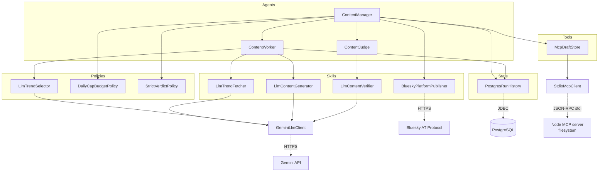
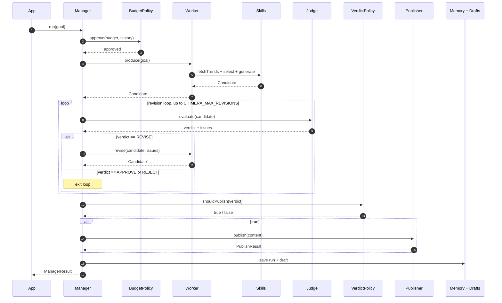
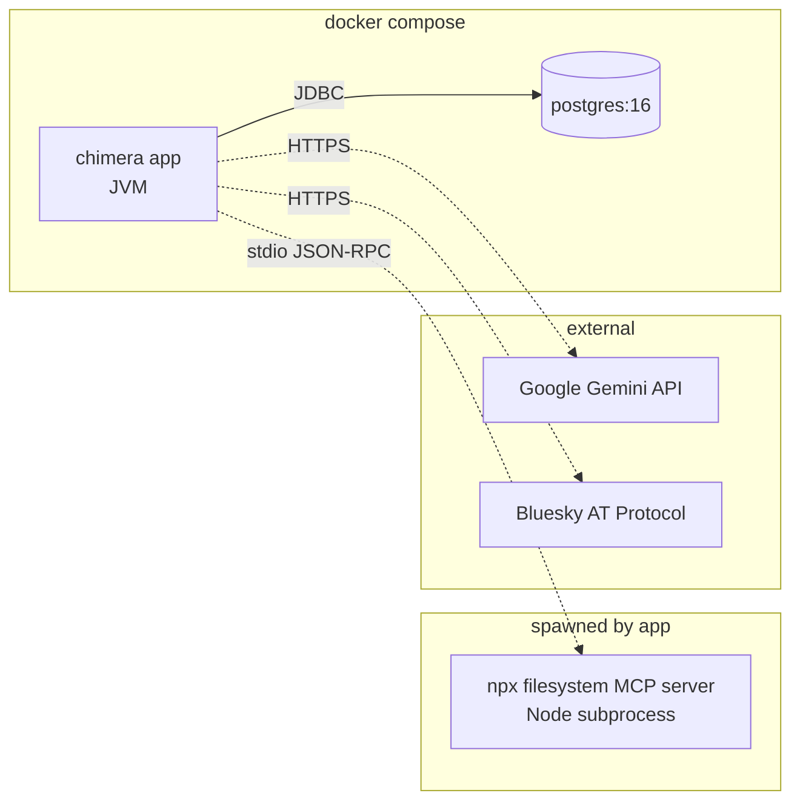

# Architecture

Project Chimera is an autonomous AI influencer agent. It picks a topic,
writes a post, has another LLM review it, and publishes to a real social
network. This document explains the shape of the system: what the pieces
are, why they're separated the way they are, and what happens when the
agent runs.

---

## High level

There are five layers, top to bottom:

| Layer | Job | Examples in the codebase |
|---|---|---|
| **Agents** | Roles that coordinate or execute work | `ContentManager`, `ContentWorker`, `ContentJudge` |
| **Policies** | Pure decisions the agents consult | `LlmTrendSelector`, `DailyCapBudgetPolicy`, `StrictVerdictPolicy` |
| **Skills** | Capabilities the agents and policies use | `LlmTrendFetcher`, `LlmContentGenerator`, `LlmContentVerifier`, `BlueskyPlatformPublisher` |
| **State** | What the agent remembers across runs | `PostgresRunHistory` |
| **External clients** | Wire-protocol shims to the outside world | `GeminiLlmClient`, `StdioMcpClient`, JDBC, Bluesky HTTP |

Every layer talks to the layer below through an **interface**. Concrete
implementations are wired together exactly once, in `App.java`.

---

## Component map

The arrows show **runtime dependency**, not data flow. Read it as: "uses".
The Manager uses everything; the Worker uses skills + memory; the Judge
uses one verifier; only the external clients touch the network.

Notice four LLM-backed components share one `GeminiLlmClient`. Same model,
four different prompts, four different roles. **In agentic systems, roles
are made of prompts, not classes.**

---

## One cycle, end to end

This is what `make run` does. The Manager runs this loop `CHIMERA_POSTS_PER_RUN` times.

The **revision loop** is the agentic moment: the Worker doesn't just
produce a candidate once -- it can be told to try again with the Judge's
feedback, up to a configured cap. This is what makes the system multi-turn
rather than procedural.

---

## Deployment

`docker compose up` starts the app and Postgres. The MCP server is spawned
on demand by the app process when `CHIMERA_MCP_DRAFTS=true`. Gemini and
Bluesky are real external services -- the agent's behavior depends on
their availability.

---

## Why this shape

A few decisions worth understanding because they show up across the
codebase:

**Skills, policies, and agents are separated.** A "skill" knows how to do
a single thing (`LlmContentGenerator.generate`). A "policy" makes a
single decision (`TrendSelector.select`). An "agent" composes skills and
policies to do a multi-step job (`ContentManager.run`). Mixing these
collapses into the procedural pipeline pattern, which is hard to evolve.

**Every external call is behind an interface.** `LlmClient`, `RunHistory`,
`PlatformPublisher`, `McpClient`, `TrendFetcher`. Anywhere you'd want
to swap providers (Gemini -> Claude, Postgres -> SQLite, Bluesky -> X),
it's a one-line constructor change in `App.java`.

**Memory is event-sourced, not relational.** Each pipeline cycle becomes
a single `RunRecord` stored as JSONB in one table. Indexes on JSON paths
support the queries the agent actually makes (find by category, find by
content id). No migrations when records evolve.

**The Judge has a strict output contract.** The Verifier's prompt asks
for JSON with a verdict enum. If the LLM returns garbage, we throw
rather than default to APPROVE. Safety guardrails are policy code, not
LLM trust.

**Logs at agent boundaries.** Each agent and external client logs what
it's doing as it does it (`Worker: selecting...`, `Judge: verdict=APPROVE`,
`LLM responded in 2150ms`). You can read the agent's whole reasoning
process from the terminal.

---

## Configuration surface

Everything that varies between environments is in `.env`:

| Variable | Purpose |
|---|---|
| `GEMINI_API_KEY`, `GEMINI_MODEL` | LLM access |
| `DATABASE_URL`, `DATABASE_USER`, `DATABASE_PASSWORD` | Memory store |
| `BLUESKY_HANDLE`, `BLUESKY_APP_PASSWORD` | Publishing target |
| `CHIMERA_PLATFORM`, `CHIMERA_CATEGORY`, `CHIMERA_PERSONA` | Goal shape |
| `CHIMERA_BUDGET`, `CHIMERA_DAILY_CAP` | Cost controls |
| `CHIMERA_RUN_MODE` (`once` / `loop`), `CHIMERA_LOOP_INTERVAL_MINUTES` | Lifecycle |
| `CHIMERA_POSTS_PER_RUN`, `CHIMERA_MAX_REVISIONS` | Manager loop tuning |
| `CHIMERA_MCP_DRAFTS`, `CHIMERA_DRAFTS_DIR` | MCP integration toggle |

The same JAR runs identically in every environment; only the variables
change.
