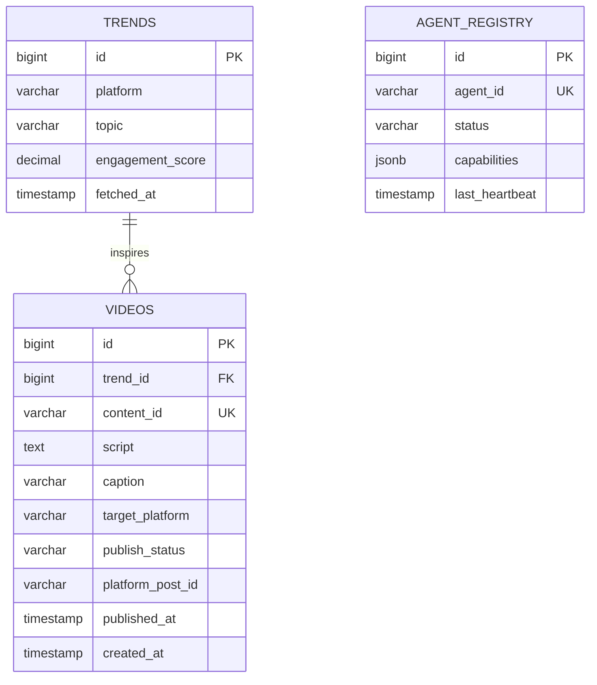

# Technical Specification

This document defines the API contracts and data schemas for Project Chimera.

---

## 1. TrendFetcher API

### Request

```json
{
  "platform": "tiktok",
  "category": "fitness"
}
```

| Field | Type | Required | Description |
|---|---|---|---|
| `platform` | String | Yes | Social media platform identifier (e.g., `"tiktok"`, `"instagram"`) |
| `category` | String | Yes | Content niche or category (e.g., `"fitness"`, `"cooking"`) |

**Java record:** `TrendRequest(String platform, String category)`

### Response

```json
{
  "platform": "tiktok",
  "category": "fitness",
  "trends": [
    {
      "topic": "morning workout routine",
      "engagementScore": 0.89
    }
  ]
}
```

| Field | Type | Required | Description |
|---|---|---|---|
| `platform` | String | Yes | Echo of request platform |
| `category` | String | Yes | Echo of request category |
| `trends` | List\<Trend\> | Yes | Discovered trends, may be empty |

**Java record:** `TrendResponse(String platform, String category, List<Trend> trends)`

### Trend Object

```json
{
  "topic": "morning workout routine",
  "engagementScore": 0.89
}
```

| Field | Type | Required | Description |
|---|---|---|---|
| `topic` | String | Yes | Human-readable trend label |
| `engagementScore` | double | Yes | Normalized engagement score, 0.0--1.0 |

**Java record:** `Trend(String topic, double engagementScore)`

---

## 2. ContentGenerator API

### Request

```json
{
  "topic": "morning workout routine",
  "characterReferenceId": "fit_chimera_v1",
  "budget": 5.00
}
```

| Field | Type | Required | Description |
|---|---|---|---|
| `topic` | String | Yes | Trend topic to generate content for |
| `characterReferenceId` | String | Yes | Persona ID for character consistency |
| `budget` | double | Yes | Maximum allowed spend (USD) for this generation call |

**Java record:** `ContentGenerationRequest(String topic, String characterReferenceId, double budget)`

### Response

```json
{
  "contentId": "draft_video_001",
  "script": "Intro hook...\nMain content...\nCall to action...",
  "caption": "Transform your mornings with this simple routine",
  "targetPlatform": "tiktok"
}
```

| Field | Type | Required | Description |
|---|---|---|---|
| `contentId` | String | Yes | Unique identifier for the generated draft |
| `script` | String | Yes | Video script body |
| `caption` | String | Yes | Platform-optimized caption |
| `targetPlatform` | String | Yes | Target social media platform |

**Java record:** `GeneratedContent(String contentId, String script, String caption, String targetPlatform)`

### Exceptions

| Exception | When | Description |
|---|---|---|
| `BudgetExceededException` | `budget` is insufficient for the requested generation | Thrown before any API calls are made. Message includes the shortfall amount. |

**Java interface:**
```java
public interface ContentGenerator {
    GeneratedContent generate(ContentGenerationRequest req) throws BudgetExceededException;
}
```

---

## 3. Database Schema

### Entity-Relationship Diagram



### Table Definitions

#### `trends`

| Column | Type | Constraints | Description |
|---|---|---|---|
| `id` | BIGINT | PK, auto-increment | Primary key |
| `platform` | VARCHAR(50) | NOT NULL | Social platform (e.g., `"tiktok"`) |
| `topic` | VARCHAR(255) | NOT NULL | Trend topic text |
| `engagement_score` | DECIMAL(4,3) | NOT NULL, CHECK (0..1) | Normalized engagement score |
| `fetched_at` | TIMESTAMP | NOT NULL, DEFAULT NOW() | When the trend was fetched |

#### `videos`

| Column | Type | Constraints | Description |
|---|---|---|---|
| `id` | BIGINT | PK, auto-increment | Primary key |
| `trend_id` | BIGINT | FK → trends.id | Source trend |
| `content_id` | VARCHAR(100) | UNIQUE, NOT NULL | Logical content identifier |
| `script` | TEXT | NOT NULL | Video script body |
| `caption` | VARCHAR(500) | | Platform caption |
| `target_platform` | VARCHAR(50) | NOT NULL | Target platform |
| `publish_status` | VARCHAR(20) | NOT NULL, DEFAULT 'draft' | One of: `draft`, `scheduled`, `published`, `failed` |
| `platform_post_id` | VARCHAR(100) | | Platform-native post ID after publishing |
| `published_at` | TIMESTAMP | | Actual publish timestamp |
| `created_at` | TIMESTAMP | NOT NULL, DEFAULT NOW() | Record creation time |

#### `agent_registry`

| Column | Type | Constraints | Description |
|---|---|---|---|
| `id` | BIGINT | PK, auto-increment | Primary key |
| `agent_id` | VARCHAR(100) | UNIQUE, NOT NULL | Agent identifier (e.g., `"chimera_agent_1"`) |
| `status` | VARCHAR(20) | NOT NULL | One of: `available`, `busy`, `offline` |
| `capabilities` | JSONB | NOT NULL | Array of capability strings |
| `last_heartbeat` | TIMESTAMP | NOT NULL | Last availability heartbeat |

---

## 4. Java Type Summary

All DTOs are immutable Java 21 records:

| Record | Package | Purpose |
|---|---|---|
| `Trend` | `com.chimera` | Single trend item |
| `TrendRequest` | `com.chimera` | TrendFetcher input |
| `TrendResponse` | `com.chimera` | TrendFetcher output |
| `ContentGenerationRequest` | `com.chimera` | ContentGenerator input |
| `GeneratedContent` | `com.chimera` | ContentGenerator output |

| Interface | Purpose |
|---|---|
| `ContentGenerator` | Skill interface for content generation |

| Exception | Purpose |
|---|---|
| `BudgetExceededException` | Resource Governor budget enforcement |
